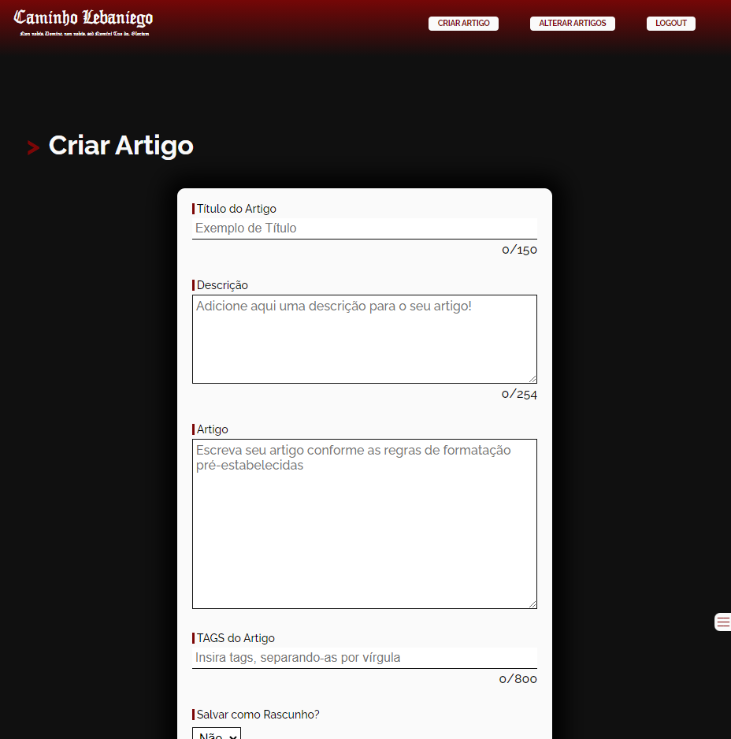
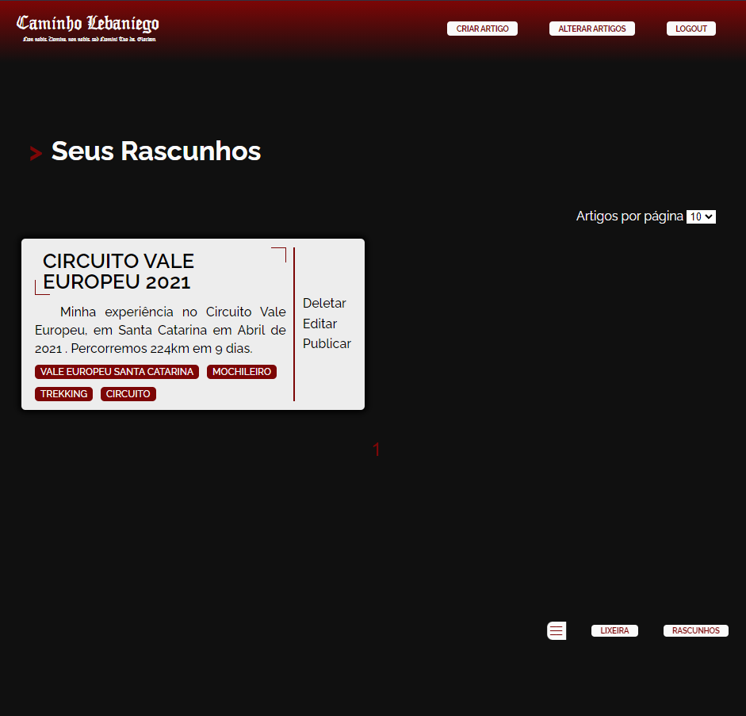

# Caminho Lebaniego

Saudações meu caro, esse é o repositório de um projeto que está atualmente na web. Veja ele em: [caminholebaniego.com.br](https://caminholebaniego.com.br).

## Licença
Esse não é um projeto open-source. Ainda que o código esteja aqui para você vizualizar e ter ideias, você não pode usá-lo comercialmente ou de modo criativo. Dessa forma, não dou a você autorização para copiar nenhuma parte do código. Para mais informações veja a [licença](./LICENSE).

## Estrutura do projeto
O modelo básico do projeto é um frontend em VueJS que se comunica com uma API Laravel privada. A função dessa API é fornecer o conteúdo alfanumérico das páginas e, em alguns momentos, as imagens. 

## Área do Administrador
Visto que as views públicas são públicas e você mesmo pode acessá-las via [caminholebaniego.com.br](https://caminholebaniego.com.br), aqui mostrarei um pouco da área do administrador e suas features. Essa área só pode ser acessada em um dispositivo não-mobile. 

# Objetivos Futuros
- Carregar imagens específicas da API de acordo com a resolução do dispositivo que está fazendo a requisição;
- Guardar todas as imagens do projeto na API (visando a implementação do tópico anterior);
- Padronizar o método de obtenção de informações de algumas páginas no banco de dados, ou seja, depreciar o uso de JSON e HTML no próprio servidor;
